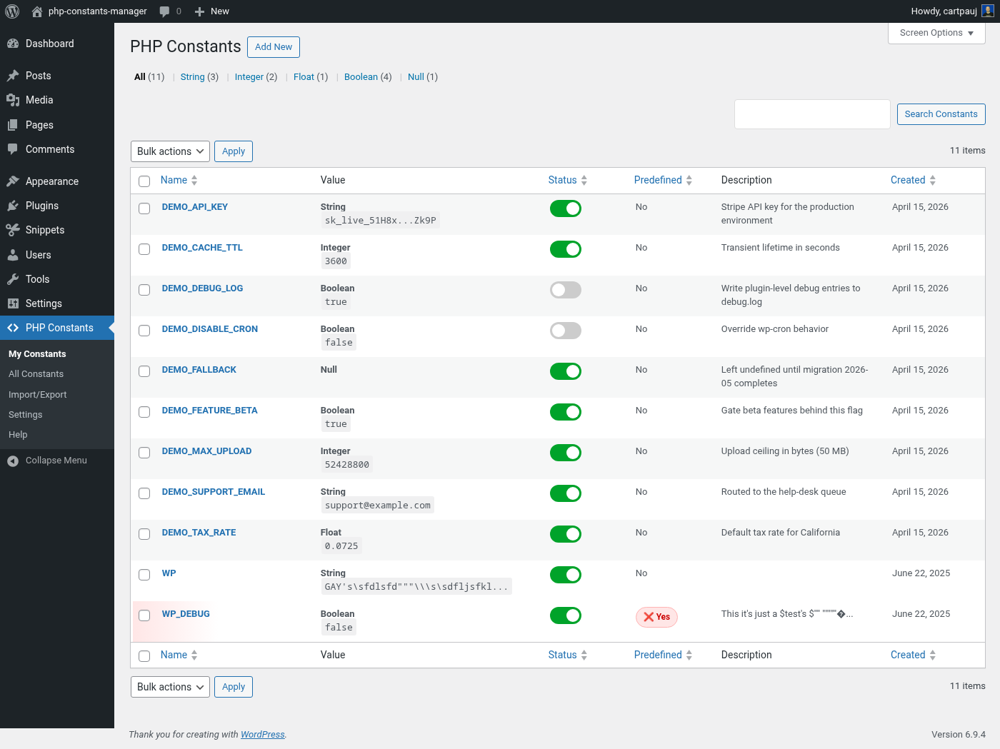

# PHP Constants Manager

Manage PHP `define()` constants from the WordPress admin or WP-CLI — no more editing `wp-config.php`.


- **Install from WordPress.org:** <https://wordpress.org/plugins/php-constants-manager/>
- **Requires:** WordPress 5.0+ · PHP 7.4+
- **License:** GPL-2.0-or-later

## What it does

- CRUD for PHP constants through a familiar `WP_List_Table` UI
- Five typed values: `string`, `integer`, `float`, `boolean`, `null`, with strict validation
- Active / inactive toggle — disable a constant without deleting it
- **Predefined-conflict detection** — tells you when something else (wp-config, another plugin) already owns a name, so your value is saved but won't take effect
- Optional **early loading** via an auto-generated must-use plugin, so your constants win race conditions with other plugins
- CSV import / export for backup and site-to-site migration
- **WP-CLI command suite** (`wp phpcm ...`) that mirrors every admin operation — ideal for CI/CD and multi-site provisioning

## Admin UI



## WP-CLI

When WP-CLI is installed the plugin registers a full `phpcm` command family:

| Command | What it does |
|---|---|
| `wp phpcm list [--active] [--inactive] [--type=<t>] [--search=<q>] [--format=<f>]` | List managed constants |
| `wp phpcm get <name>` | Show one constant (`--field=<field>` for a single column) |
| `wp phpcm add <name> [<value>] [--type=<t>] [--description=<text>] [--inactive]` | Create; `--porcelain` prints just the new id |
| `wp phpcm update <name> [--value=<v>] [--type=<t>] [--description=<text>] [--active\|--inactive]` | Update fields |
| `wp phpcm delete <name>... [--yes]` | Delete one or more (variadic) |
| `wp phpcm activate \| deactivate \| toggle <name>...` | Flip active state |
| `wp phpcm defined <name>` | Report whether a constant is defined and by whom (this plugin, early-load, or elsewhere) |
| `wp phpcm all-defines [--user-defined] [--search=<q>]` | Inspect every PHP constant in the process |
| `wp phpcm status` | Health summary (table, counts, early-loading state) |
| `wp phpcm import <file\|-> [--overwrite]` | Import CSV (file or stdin) |
| `wp phpcm export [<file>] [--active] [--inactive] [--type=<t>]` | Export CSV (file or stdout) |
| `wp phpcm early-loading enable \| disable \| status` | Manage the MU early-loading plugin |

`-` reads from stdin for `add`, `update`, and `import`. Run `wp help phpcm <subcommand>` for full flag docs.

### Quickstart

```bash
wp phpcm add MY_API_KEY "sk_live_..." --description="External API key"
wp phpcm add FEATURE_BETA true --type=boolean
wp phpcm defined MY_API_KEY
wp phpcm export backup.csv
```

## Install

Pick whichever is easier:

- **From your WordPress admin:** *Plugins → Add New → search "PHP Constants Manager" → Install → Activate.*
- **From WordPress.org:** download the ZIP at <https://wordpress.org/plugins/php-constants-manager/> and upload it under *Plugins → Add New → Upload Plugin.*
- **From source:**

  ```bash
  cd wp-content/plugins
  git clone https://github.com/cartpauj/php-constants-manager.git
  wp plugin activate php-constants-manager
  ```

The database table (`{prefix}phpcm_constants`) is created automatically on activation.

## How constants get loaded

| Mode | Hook | Available to |
|---|---|---|
| Normal (default) | `plugins_loaded`, priority 1 | Themes, most other plugins' later hooks |
| Early loading (opt-in) | MU plugin, loaded before all regular plugins | Everything — other plugins can rely on your constants during their own boot |

Toggle early loading from *PHP Constants → Settings*, or `wp phpcm early-loading enable`.

## Contributing

Issues and PRs are welcome. The plugin is structured around:

- `php-constants-manager.php` — main plugin class, admin hooks
- `includes/phpcm-helpers.php` — shared casting / validation / formatting (single source of truth, used by the admin UI, the CLI, and the generated MU plugin)
- `includes/class-phpcm-db.php` — DB abstraction
- `includes/class-phpcm-import-export.php` — CSV service (hand-rolled parser supporting embedded newlines and escaped quotes)
- `includes/class-phpcm-cli.php` — WP-CLI commands
- `views/admin/*.php` — admin UI templates

Release process is documented in [RELEASE.md](RELEASE.md).

## License

GPL v2 or later — see [LICENSE](https://www.gnu.org/licenses/gpl-2.0.html).
